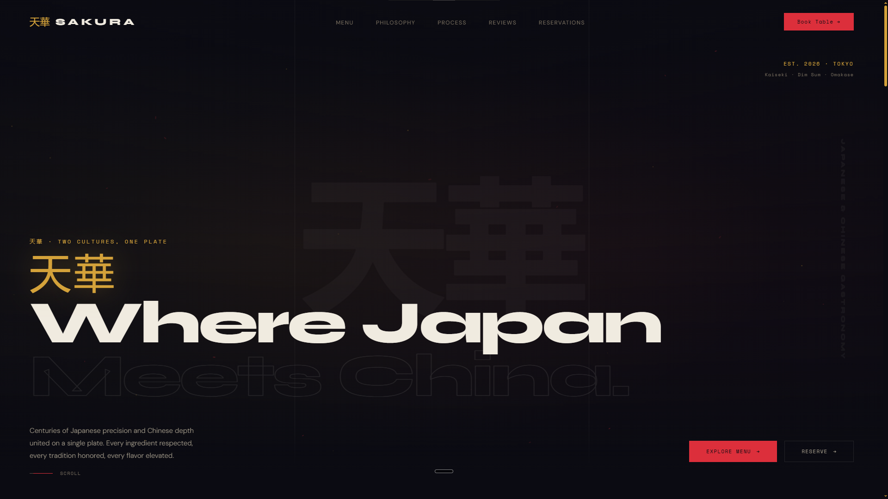
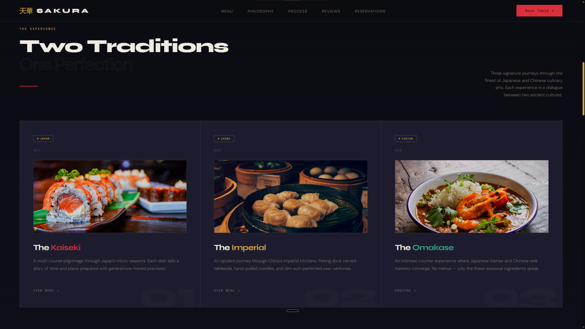
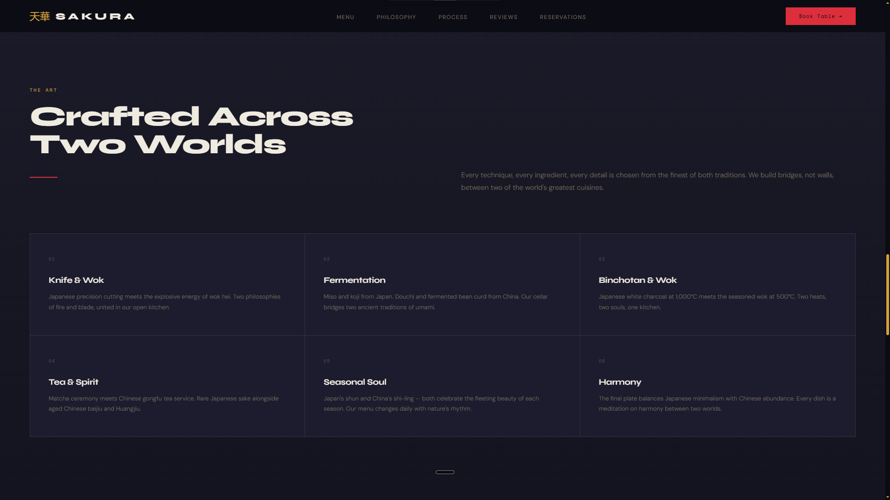
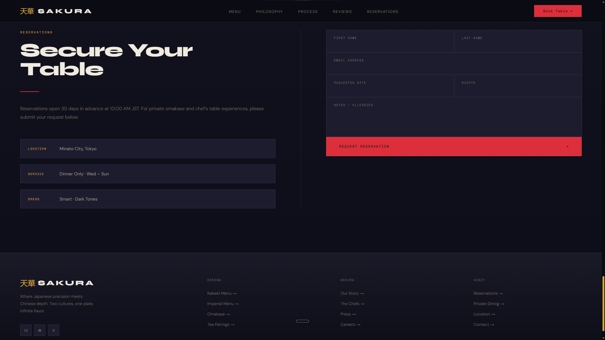

# 天華 Sakura — Japanese & Chinese Gastronomy

A single-page concept site for a fictional fine-dining restaurant in Tokyo that blends Japanese kaiseki tradition with Chinese fine dining.

🔗 **Live:** [REPLACE_WITH_ACTUAL_URL]

## Preview


*The hero section with the kanji watermark, tagline, and particle canvas background.*


*The menu section displaying the three signature dining experiences as product cards.*


*The features section with six interactive tiles detailing the restaurant's craft philosophy across both cuisines.*


*The reservation form and footer with contact info, social links, and navigation columns.*

## About

Sakura is a demo build for a restaurant concept that doesn't pick a side between two cuisines — kaiseki course structure on one hand, Cantonese-leaning technique on the other, served under one roof in Minato City. The idea was to design a site that feels like the restaurant itself: dark, deliberate, a little theatrical, instead of the bright stock-photo look most restaurant templates default to.

## What's on the page

- **Hero** — full-screen intro with the "Two Cultures, One Plate" tagline and a particle canvas background
- **Menu** — kaiseki, dim sum, and omakase offerings laid out as product cards
- **About** — the restaurant's story and philosophy
- **Features** — what makes the dining experience different
- **Reviews** — guest reviews and award mentions
- **Contact** — location and reservation details

## Built with


- Vanilla HTML/CSS/JS — no framework, no build step
- CSS custom properties for the entire color system (jewel-tone palette: deep red, gold, jade)
- Canvas-based particle background and scroll-reveal/count-up animations, hand-written (no animation library)
- Google Fonts — Syne for display type, DM Sans for body text

## Why I built it this way

Most restaurant landing pages lean on one warm palette and a hero photo. This one uses a near-black background with red/gold/jade accents specifically so the "two cuisines, one plate" idea shows up visually, not just in the copy. The particle canvas in the hero was written from scratch instead of pulling in a library, since the site only needed one lightweight effect and not a whole animation dependency.

## Running it locally

```
sakura/
├── index.html
├── css/
│ └── style.css
└── js/
└── script.js
```

Just open `index.html` in a browser — no build step, no dependencies.

## Status

This is a demo/concept build. Contact details, reviews, and awards on the page are illustrative, not real.
